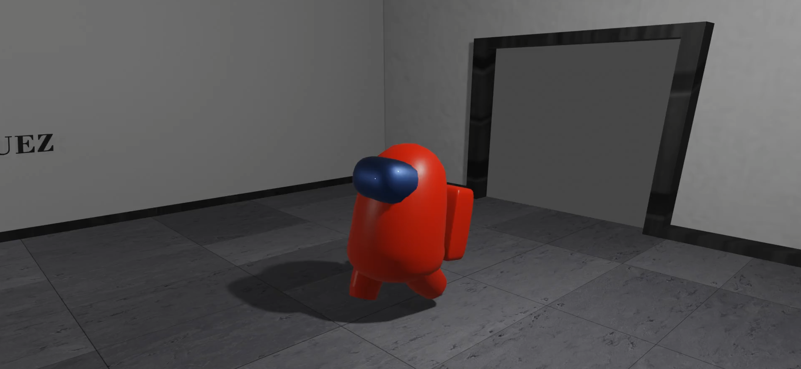
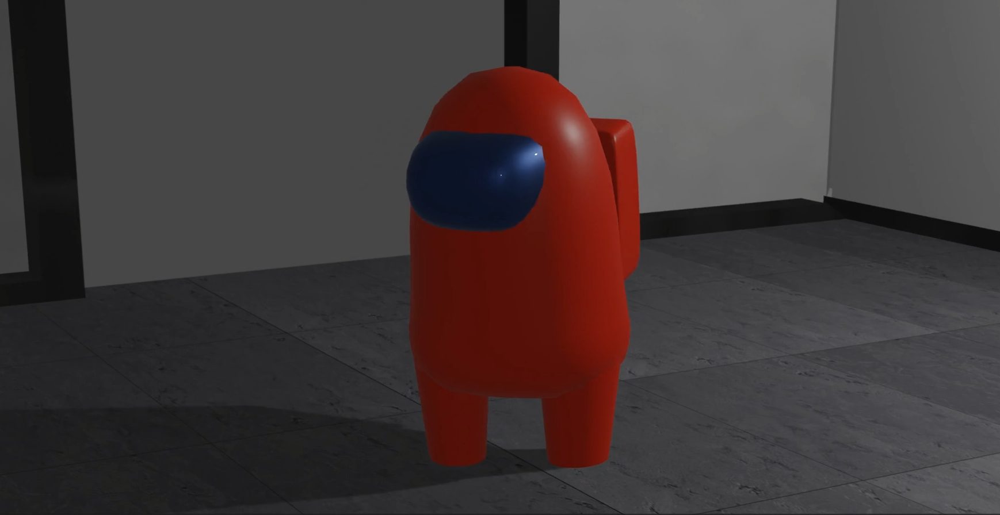

# Animación 3D de Among Us en Blender

Renderizado de animación 3D (Among Us)

Este proyecto contiene una animación 3D de Among Us creada utilizando Blender. La animación representa [describe la escena o acción que has animado]. Puedes ver la animación en acción en el siguiente enlace: [enlace a un video de demostración si está disponible].

## Contenido del Repositorio

- `Animacion3D.blend`: El archivo principal de Blender que contiene la escena y la animación.
- `texturas/`: Carpeta que contiene las texturas utilizadas en la animación.
- `Renderizado/`: Carpeta opcional donde se encuentra la animación renderizada.
- `capturas_de_pantalla/`: Carpeta que muestra capturas de pantalla de la animación.

## Capturas de Pantalla

## Cómo Usar

1. Descarga el archivo `Animacion3D.blend` y las texturas desde este repositorio.
2. Abre el archivo `Animacion3D.blend` en Blender.

## Créditos

- Música de fondo: Among Us Drip Theme Song Original.

## Contribuciones

¡Las contribuciones son bienvenidas! Si deseas mejorar esta animación o agregar nuevas características, siéntete libre de hacer un fork de este repositorio y enviar un pull request.

## Licencia

Este proyecto está bajo la licencia MIT. Consulta el archivo `LICENSE` para obtener más detalles.
